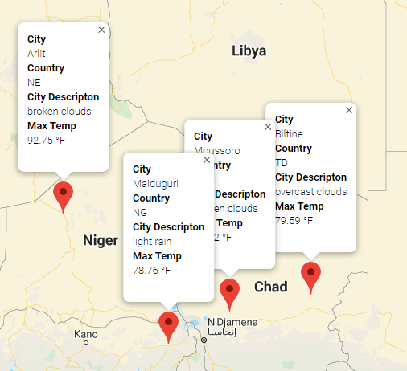

# World_Weather_Analysis

## Purpose
The purpose of this exercise was to learn how to utilize API's within a query and pull data from a website.

We learned how to:
1. Connect to various APIs.
2. Pull data down from the APIs.
3. Use the retrieved data to create:

    a. Sample the data
    
    b. Create dataframes from the data
    
    c. Various types of maps with google maps

I created trip itinerary to Africa by using weather data from a random number of cities selected from around the world.  My city selection was based on an average temperature between 50 and 100 degrees. Also, randomly picked.

Below is a snapshot of my route:

And below is a snapshot of my map with markers:

